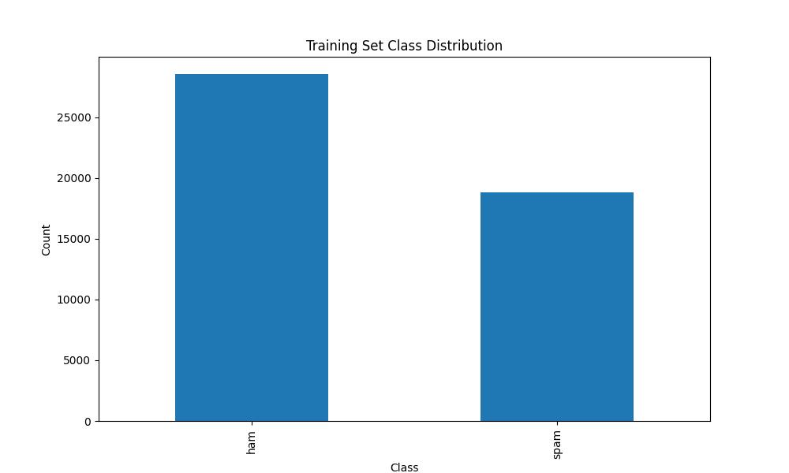
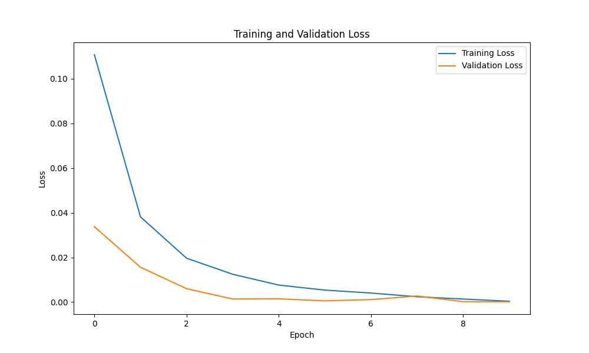
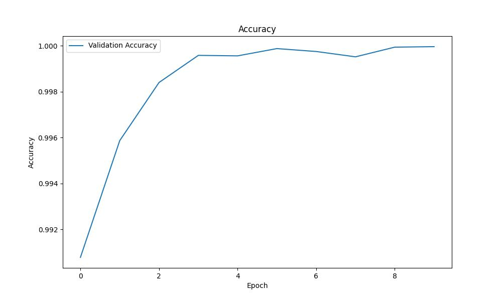
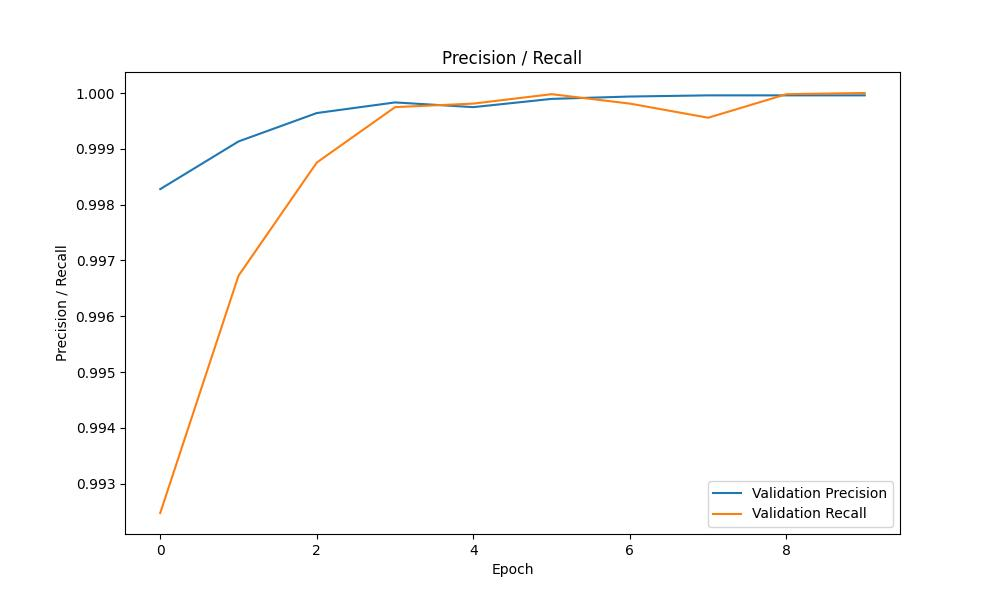
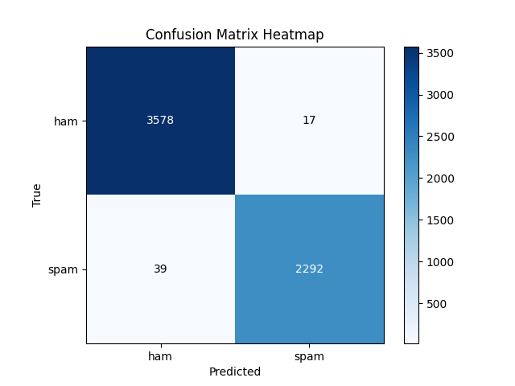

# RoBERTa-based SMS Spam Detection
Spam messages often contain harmful links or phishing scams, posing serious risks to organizations and their users. Adopting our RoBERTa-based spam detection system can significantly strengthen an organization's security measures. This system proficiently identifies and eliminates spam messages, providing an additional security layer that protects organizations from potential financial losses, legal issues, and damage to their reputation.

## Dataset
The dataset consists of messages labeled by spam or ham (not spam), merged from 3 data sources:
1.	SMS Spam Collection https://www.kaggle.com/datasets/uciml/sms-spam-collection-dataset
2.	Telegram Spam Ham https://huggingface.co/datasets/thehamkercat/telegram-spam-ham/tree/main
3.	Enron Spam:  https://huggingface.co/datasets/SetFit/enron_spam/tree/main (only used message column and labels)

The prepare script for enron is available at https://github.com/congduytran12/Spam-Detection/tree/main/data/enron.
The prepare script for telegram is available at https://github.com/congduytran12/Spam-Detection/tree/main/data/telegram.
The data is split into 80% train, 10% validation, and 10% test sets; the scripts used to split and merge of the 3 data sources are available at https://github.com/congduytran12/Spam-Detection/tree/main/data/utils.

### Dataset Class Distribution

Training    |  Validation     |  Testing           
:-------------------------:|:-------------------------:|:-------------------------: 
 Class Distribution |  Class Distribution |   Class Distribution


## Model Architecture
The model  is fine-tuned RoBERTa base: 
roberta-base: https://huggingface.co/roberta-base

## Metrics
Loss    |  Accuracy      |  Precision / Recall     |    Confusion Matrix          
:-------------------------:|:-------------------------:|:-------------------------:|:-------------------------: 
 Train / Validation |  Validation |   Validation |   Testing Set

## Required Dependencies
- numpy
- torch
- transformers
- pandas
- tqdm
- matplotlib


### Install
```
pip install -r requirements.txt
```

## Directory Structure
```
├─── data/          contains csv data files
├─── plots/         contains metrics results and plots   
├─── roberta-spam   trained model weights 
├─── utils/         contains helper functions
├─── demo.ipynb     jupyter notebook ipynb file to run the demo 
├─── detector.py    SpamMessageDetector with methods train, evaluate, detect 
└─── dataset.py     custom dataset class for spam messages
```

## Running Demo
To run the demo, please run the following file: demo.ipynb


